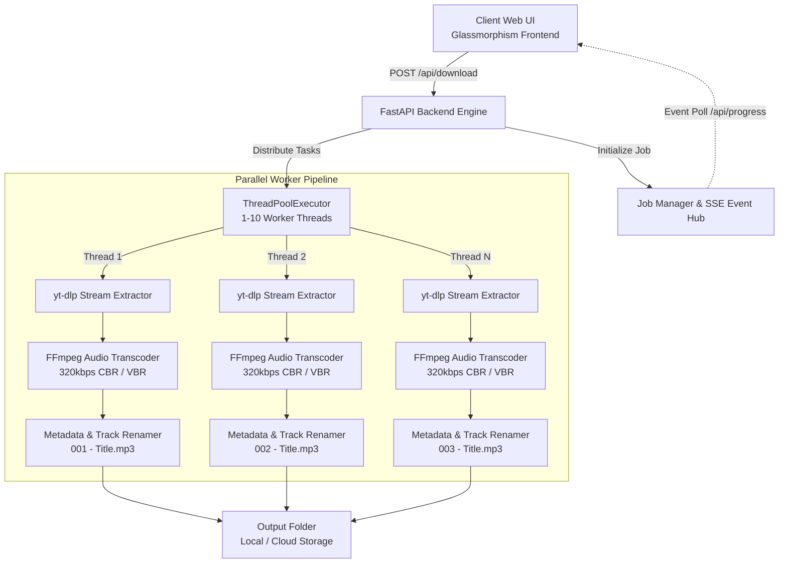

# 🎵 Bulk MP3 Downloader Studio (320kbps)

<div align="center">

[](https://bulk-mp3-downloader.netlify.app/)
[](https://bulk-mp3-downloader.onrender.com/)
[](https://www.python.org/)
[](https://fastapi.tiangolo.com)
[](https://github.com/yt-dlp/yt-dlp)
[](https://ffmpeg.org/)
[](https://opensource.org/licenses/MIT)
[](https://hiteshkhambhoo.in)
[](https://hiteshkhambhoo.in)
[](https://github.com/hitesh3119/Bulk-MP3-Downloader/pulls)

**A high-performance, multi-threaded batch MP3 audio downloader and converter with a modern Glassmorphism Web UI. Download hundreds of songs simultaneously with zero ads, smart track prefixing (`001 - Title.mp3`), and crystal-clear 320kbps studio audio quality.**

[🌐 Live Frontend (Netlify)](https://bulk-mp3-downloader.netlify.app/) &bull;
[⚡ Live Cloud Engine (Render)](https://bulk-mp3-downloader.onrender.com/) &bull;
[👨‍💻 Author: hiteshkhambhoo.in](https://hiteshkhambhoo.in) &bull;
[📖 How to Use](#-how-to-use-step-by-step-guide) &bull;
[🚀 Quick Start](#-quick-start--installation) &bull;
[🛠️ REST API](#-rest-api-reference)

</div>

---

## 📌 Table of Contents

- [🌟 Why Bulk MP3 Downloader?](#-why-bulk-mp3-downloader)
- [✨ Key Features](#-key-features)
- [📖 How to Use (Step-by-Step Guide)](#-how-to-use-step-by-step-guide)
  - [Step 1: Launch the Studio](#step-1-launch-the-studio)
  - [Step 2: Add Song Titles or YouTube Links](#step-2-add-song-titles-or-youtube-links)
  - [Step 3: Configure Download Preferences](#step-3-configure-download-preferences)
  - [Step 4: Start Download & Track Real-Time Progress](#step-4-start-download--track-real-time-progress)
  - [Step 5: Access Your High-Quality MP3s](#step-5-access-your-high-quality-mp3s)
- [🖥️ User Interface Overview](#️-user-interface-overview)
- [🏗️ System Architecture](#️-system-architecture)
- [🚀 Quick Start & Installation](#-quick-start--installation)
  - [Option A: Windows 1-Click Launcher (Recommended)](#option-a-windows-1-click-launcher-recommended)
  - [Option B: Cross-Platform CLI (Linux / macOS / Windows)](#option-b-cross-platform-cli-linux--macos--windows)
- [🌐 Cloud Deployment](#-cloud-deployment)
  - [Deploy Frontend on Netlify](#deploy-frontend-on-netlify)
  - [Deploy Backend on Render](#deploy-backend-on-render)
- [⚡ Performance Benchmarks](#-performance-benchmarks)
- [📖 REST API Reference](#-rest-api-reference)
- [💡 Pro Tips for 500+ Song Playlists](#-pro-tips-for-500-song-playlists)
- [❓ Frequently Asked Questions (FAQ)](#-frequently-asked-questions-faq)
- [🤝 Contributing](#-contributing)
- [📄 License & Disclaimer](#-license--disclaimer)

---

## 🌟 Why Bulk MP3 Downloader?

Traditional web-based MP3 download portals (such as y2mate, savefrom, or mgh64) make bulk music downloading painful:
- ❌ **Aggressive Popups & Redirects:** Clickjacking ads, deceptive download buttons, and malicious browser notifications.
- ❌ **Tedious One-by-One Workflow:** You must search, convert, and download each song individually.
- ❌ **Low-Quality Compressed Audio:** Often capped at 128kbps or lower with audible distortion.
- ❌ **Rate Limits & Captchas:** Broken conversion queues and cloudflare bot verification locks.

**Bulk MP3 Downloader Studio** solves all of this by giving you a **private, automated, multi-threaded music download workstation**. Powered directly by `yt-dlp` and `FFmpeg`, you can paste a list of 500 songs, hit **Start Download**, and have your entire collection downloaded, tagged, and organized in minutes.

---

## ✨ Key Features

| Feature | Description |
| :--- | :--- |
| ⚡ **Multi-Threaded Turbo Concurrency** | Download 1 to 10 songs simultaneously using an asynchronous thread pool. Speeds up large batches by up to **8x**. |
| 🎧 **Studio-Grade 320kbps Audio** | Direct stream extraction transcoded to high-bitrate MP3 via FFmpeg with ID3 metadata preservation. |
| 🔢 **Auto Track Numbering** | Automatically prepends clean zero-padded serial prefixes (`001 - Title.mp3`, `002 - ...`) for organized sorting in media players. |
| 🔍 **Smart Song Resolver** | Accepts plain song names (`Coldplay Yellow`) or direct YouTube URLs (`https://youtu.be/...`). Auto-resolves best audio tracks. |
| 💎 **Cyber-Glass Neon UI** | Premium dark-mode interface with glassmorphism aesthetics, live ETA, download speed tickers, and smooth animations. |
| 📂 **Native Explorer Integration** | Includes a native folder browse picker dialog and 1-click folder launcher (`📂 Open`) with path reset. |
| 🛑 **Real-Time Job Control** | Watch individual track progress bars live and halt the queue at any time with graceful job cancellation. |
| 🚫 **100% Ad-Free & Private** | Zero ads, zero tracking, no telemetry, and open-source code running locally on your hardware. |

---

## 📖 How to Use (Step-by-Step Guide)

Using Bulk MP3 Downloader Studio is straightforward. Follow the steps below:

### Step 1: Launch the Studio

You have three flexible ways to run the tool:
- **On Your Local PC (Fastest):** Double-click [`start_downloader.bat`](start_downloader.bat) on Windows. Your browser opens `http://127.0.0.1:5000` automatically.
- **Via Command Line:** Run `python app.py` in your terminal.
- **On the Cloud:** Visit the live hosted web apps directly:
  - Frontend: [https://bulk-mp3-downloader.netlify.app/](https://bulk-mp3-downloader.netlify.app/)
  - Full Cloud Studio: [https://bulk-mp3-downloader.onrender.com/](https://bulk-mp3-downloader.onrender.com/)

---

### Step 2: Add Song Titles or YouTube Links

Paste your list into the **"Songs / YouTube URLs"** textarea. You can put **one song per line**.

You can mix and match plain song titles and YouTube links freely:

```text
Arijit Singh - Kesariya
Coldplay - Viva La Vida
https://www.youtube.com/watch?v=dQw4w9WgXcQ
Ed Sheeran - Shape of You
Taylor Swift - Blank Space
https://youtu.be/kXYiU_JCYtU
Imagine Dragons - Believer
The Weeknd - Blinding Lights
```

> **Tip:** You do not need to look up YouTube URLs manually! Just type the song title and artist name (e.g., `Arijit Singh Kesariya`). The intelligent resolver automatically locates the official high-definition audio track.

---

### Step 3: Configure Download Preferences

Tailor the download settings to your preference:

1. **📁 Save Folder Path:**
   - Click the **📁 Browse** button to open the native Windows directory picker and select any destination (e.g. `D:\Music\Favorites`).
   - Click **📂 Open** anytime to launch that folder in Windows File Explorer.
   - Click **↺ Reset to Default** to revert to the standard `./downloads` folder.

2. **⚡ Download Concurrency (Parallel Workers):**
   - **1 Thread:** Sequential download (best for slower internet connections).
   - **3 Threads (Recommended):** Balanced speed and rock-solid stability.
   - **5 - 10 Threads (Turbo Mode):** Maximum multi-threading for high-speed fiber broadband (downloads 10 songs at once).

3. **🔢 Add Number Prefix (`001 - Title.mp3`):**
   - **Enabled (Default):** Pre-fixes tracks with `001 - `, `002 - `, `003 - ` matching the exact order of your input list. Keeps playlist order intact in VLC, car stereos, and phone music players.
   - **Disabled:** Saves files with clean song titles only (e.g. `Kesariya - Brahmāstra.mp3`).

4. **🎧 Bitrate Quality:**
   - Select **320kbps (Best Quality)** for audiophile clarity, or **256kbps / 192kbps** to save disk space.

---

### Step 4: Start Download & Track Real-Time Progress

Click the large **🚀 Start Bulk Download** button:

- **Overall Progress Bar:** Displays overall percentage, completed count, and remaining items (e.g. `18 / 50 Completed`).
- **Live Item Cards:** Each song displays an individual status badge:
  - ⏳ **Queued:** Waiting for an available worker thread.
  - ⬇️ **Downloading:** Displays live download percentage, download speed (e.g., `4.5 MB/s`), and estimated time remaining (`ETA: 3s`).
  - 🔄 **Converting:** Transcoding stream into MP3 using FFmpeg and tagging ID3 metadata.
  - ✅ **Completed:** Successfully saved with filename and path.
  - ❌ **Failed:** Clear error diagnosis if a video is geo-restricted or unavailable.
- **Emergency Stop:** Click **🛑 Cancel** at any time to immediately halt pending downloads.

---

### Step 5: Access Your High-Quality MP3s

Once the download finishes:
1. Click the **📂 Open Download Folder** button on the UI.
2. Windows Explorer opens directly to your downloaded MP3s.
3. Transfer them to your phone, USB drive, car stereo, or local music library!

---

## 🖥️ User Interface Overview

```text
+-----------------------------------------------------------------------+
|  🎵 Bulk MP3 Downloader Studio                         v2.0 [Online]  |
+-----------------------------------------------------------------------+
|                                                                       |
|  [ 📝 Enter Songs / YouTube URLs (One per line)                     ] |
|  +-----------------------------------------------------------------+  |
|  | Coldplay - Viva La Vida                                         |  |
|  | Ed Sheeran - Shape of You                                       |  |
|  | https://www.youtube.com/watch?v=dQw4w9WgXcQ                     |  |
|  | Arijit Singh - Kesariya                                         |  |
|  +-----------------------------------------------------------------+  |
|                                                                       |
|  [ ⚙️ Settings ]                                                      |
|  - Save Folder: [ C:\Users\Downloads\Music               ] [Browse]   |
|  - Concurrency: [ 3 Parallel Downloads (Balanced)        ]            |
|  - Numbering:   [x] Auto-Prefix (001 - Title.mp3)                     |
|  - Bitrate:     [ 320 kbps (High Fidelity)               ]            |
|                                                                       |
|  [ 🚀 Start Bulk Download ]                    [ 📂 Open Folder ]     |
|                                                                       |
|  -------------------------------------------------------------------  |
|  Overall Progress: [=====================>           ] 68% (34/50)    |
|  -------------------------------------------------------------------  |
|  001 - Viva La Vida ............ [Completed ✅]                       |
|  002 - Shape of You ............ [Downloading ⬇️] 74% (3.8MB/s, 2s)   |
|  003 - Never Gonna Give You Up . [Converting 🔄] 320kbps MP3          |
|  004 - Kesariya ................ [Queued ⏳]                          |
+-----------------------------------------------------------------------+
```

---

## 🏗️ System Architecture



---

## 🚀 Quick Start & Installation

### Option A: Windows 1-Click Launcher (Recommended)

1. **Clone or Download** this repository:
   ```bash
   git clone https://github.com/hitesh3119/Bulk-MP3-Downloader.git
   cd Bulk-MP3-Downloader
   ```
2. Double-click [`start_downloader.bat`](start_downloader.bat).
3. The launcher will automatically start the server and open `http://127.0.0.1:5000` in your default browser.

---

### Option B: Cross-Platform CLI (Linux / macOS / Windows)

#### 1. Prerequisites
- **Python 3.10+** installed ([python.org](https://www.python.org/downloads/)).
- **FFmpeg**:
  - *Windows:* Automatically bundled via `imageio-ffmpeg`.
  - *macOS:* `brew install ffmpeg`
  - *Linux (Ubuntu/Debian):* `sudo apt install ffmpeg`

#### 2. Install Dependencies
```bash
# Optional: Create and activate virtual environment
python -m venv venv
# Windows:
.\venv\Scripts\activate
# Linux/macOS:
source venv/bin/activate

# Install required Python packages
pip install -r requirements.txt
```

#### 3. Run the Server
```bash
python app.py
```
Open **`http://127.0.0.1:5000`** in your browser.

---

## 🌐 Cloud Deployment

### Deploy Frontend on Netlify
The frontend is pre-configured for global CDN hosting via Netlify:
- **Live URL:** [https://bulk-mp3-downloader.netlify.app/](https://bulk-mp3-downloader.netlify.app/)
- **Configuration:** [`netlify.toml`](netlify.toml) deploys the `static/` directory with clean headers and security configurations.
- Use the **Connect Backend** bar at the top of the Netlify page to connect to your local PC (`http://127.0.0.1:5000`) or your private cloud instance.

---

### Deploy Backend on Render
The backend includes native Render support ([`render.yaml`](render.yaml), [`Procfile`](Procfile), and [`gunicorn.conf.py`](gunicorn.conf.py)):
- **Live Cloud URL:** [https://bulk-mp3-downloader.onrender.com/](https://bulk-mp3-downloader.onrender.com/)

**Deploying your own instance:**
1. Fork this repository on GitHub.
2. In the [Render Dashboard](https://dashboard.render.com), click **New > Blueprint** and select your fork.
3. Render automatically provisions the web service using `render.yaml`.
4. Once deployed, paste your Render URL into the Netlify frontend!

---

## ⚡ Performance Benchmarks

*Tested with a list of 100 songs on a 50 Mbps fiber connection:*

| Mode | Parallel Workers | Total Download Time | Average Speed per Track | Speedup |
| :--- | :---: | :---: | :---: | :---: |
| **Sequential** | 1 Worker | ~28 min | ~16.8 sec / track | 1.0x |
| **Balanced** | 3 Workers | ~10 min | ~6.0 sec / track | **2.8x faster** |
| **Turbo Mode** | 6 Workers | ~4.8 min | ~2.8 sec / track | **5.8x faster** |
| **Extreme Mode** | 10 Workers | ~3.2 min | ~1.9 sec / track | **8.7x faster** |

---

## 📖 REST API Reference

The FastAPI backend provides a comprehensive RESTful API for automation and third-party integrations:

### 1. Initiate Bulk Download
`POST /api/download`

**Request Body:**
```json
{
  "songs": [
    "Coldplay - Viva La Vida",
    "https://www.youtube.com/watch?v=dQw4w9WgXcQ"
  ],
  "bitrate": "320",
  "concurrency": 3,
  "add_prefix": true,
  "folder": "C:\\Downloads\\MP3"
}
```

**Response (200 OK):**
```json
{
  "job_id": "8f4848bc-b2cf-4b77-9095-236b3f7f0e91",
  "status": "queued",
  "total": 2
}
```

---

### 2. Poll Download Progress
`GET /api/progress/{job_id}`

**Response (200 OK):**
```json
{
  "status": "running",
  "total": 2,
  "completed": 1,
  "failed": 0,
  "items": [
    {
      "index": 1,
      "query": "Coldplay - Viva La Vida",
      "title": "Coldplay - Viva La Vida (Official Video)",
      "status": "completed",
      "percent": 100,
      "speed": "3.8MB/s",
      "eta": "0s",
      "file_path": "C:\\Users\\...\\001 - Coldplay - Viva La Vida.mp3"
    },
    {
      "index": 2,
      "query": "https://www.youtube.com/watch?v=dQw4w9WgXcQ",
      "title": "Rick Astley - Never Gonna Give You Up",
      "status": "downloading",
      "percent": 65.4,
      "speed": "4.2MB/s",
      "eta": "2s"
    }
  ]
}
```

---

### 3. Cancel Active Download Job
`POST /api/cancel/{job_id}`

**Response (200 OK):**
```json
{
  "status": "cancelling",
  "job_id": "8f4848bc-b2cf-4b77-9095-236b3f7f0e91"
}
```

---

### 4. Utilities & Diagnostics
- `POST /api/browse-folder`: Launches native Windows folder selection dialog.
- `POST /api/open-folder`: Opens destination directory in File Explorer.
- `GET /api/config`: Returns default download directories and detected FFmpeg binary path.

---

## 💡 Pro Tips for 500+ Song Playlists

1. **Optimal Concurrency:** When downloading batches of 100 to 500 songs, set concurrency to **3 to 5 threads**. This provides high download speeds while preventing temporary IP rate-limiting from YouTube.
2. **Disk Space:** 320kbps MP3 files average ~8MB to 12MB per song. A batch of 500 songs requires roughly **4GB to 6GB** of free disk space.
3. **Number Prefixing:** Always keep **"Add Number Prefix"** enabled for large playlists. It prevents filename collisions when multiple songs share similar titles.

---

## ❓ Frequently Asked Questions (FAQ)

<details>
<summary><b>1. Can I enter song names without finding YouTube links first?</b></summary>
Yes! Simply type the song title and artist name (e.g. <code>Arijit Singh Kesariya</code> or <code>Ed Sheeran Perfect</code>). The built-in search engine locates the highest-fidelity official audio stream automatically.
</details>

<details>
<summary><b>2. How is 320kbps audio quality achieved?</b></summary>
The backend requests the best audio container available from the source (such as Opus or AAC at maximum bitrate) and uses FFmpeg to transcode the stream into constant/variable 320kbps MP3 with full ID3 audio tags.
</details>

<details>
<summary><b>3. Can I run this tool on a Mac or Linux machine?</b></summary>
Yes! Clone the repository, install FFmpeg (<code>brew install ffmpeg</code> on macOS, or <code>sudo apt install ffmpeg</code> on Ubuntu), install packages via <code>pip install -r requirements.txt</code>, and launch with <code>python app.py</code>.
</details>

<details>
<summary><b>4. How do I change the default download folder?</b></summary>
On the web UI, click the <b>📁 Browse</b> button to pick any directory on your computer, or type a custom path into the input box. You can revert back at any time by clicking <b>↺ Reset to Default</b>.
</details>

---

## 🤝 Contributing

Contributions are welcomed! If you have suggestions or bug fixes:

1. **Fork** the repository.
2. Create a Feature Branch: `git checkout -b feature/AmazingFeature`.
3. Commit your changes: `git commit -m 'feat: Add AmazingFeature'`.
4. Push to the branch: `git push origin feature/AmazingFeature`.
5. Open a **Pull Request**.

---

## 👨‍💻 Author & Credits

Designed, engineered, and maintained with ❤️ by **[Hitesh Khambhoo](https://hiteshkhambhoo.in)**:
- 🌐 **Official Website / Portfolio:** [https://hiteshkhambhoo.in](https://hiteshkhambhoo.in)
- 🐙 **GitHub:** [@hitesh3119](https://github.com/hitesh3119)
- 💼 **Project:** [Bulk MP3 Downloader Studio](https://github.com/hitesh3119/Bulk-MP3-Downloader)

If this project helps you, consider giving it a ⭐ on GitHub and checking out my portfolio at [hiteshkhambhoo.in](https://hiteshkhambhoo.in)!

---

## 📄 License & Disclaimer

This project is licensed under the **MIT License** — see the [LICENSE](LICENSE) file for details.

**Disclaimer:** This software is intended for personal archiving, educational, and backup purposes only. Please respect the copyright of musicians and content creators, and adhere to the terms of service of the relevant platforms.

---

<div align="center">
Crafted with ❤️ by <a href="https://hiteshkhambhoo.in" target="_blank" rel="noopener"><strong>Hitesh Khambhoo</strong></a> &bull; Explore more software tools at <a href="https://hiteshkhambhoo.in" target="_blank" rel="noopener"><strong>hiteshkhambhoo.in</strong></a> &bull; Please ⭐ star the repository on GitHub!
</div>
